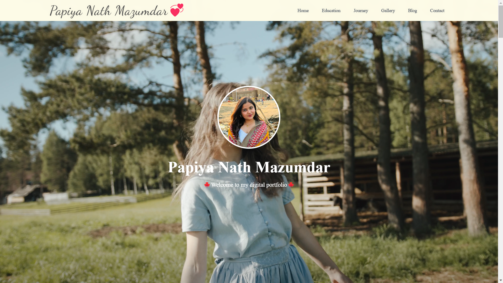

# 🚀 Client's Portfolio

  

## 🌟 Introduction  
This is **Version 3** of my personal portfolio...

📂 Papiya's Portfolio

🌟 A Modern and Elegant Portfolio Built with React

This is a client portfolio project developed for Papiya Nath Mazumdar, showcasing her artworks, blogs, personal journey, testimonials, and more in a visually appealing and interactive way. The project was built with a clean, elegant UI, focusing on a light theme with shades of yellow and light yellow to provide a warm and engaging user experience.

🚀 Live Preview
🔗https://papiya.vercel.app/

🎯 Project Overview

This portfolio is a Single Page Application (SPA) built with React.js and powered by Node.js on the backend. The project was developed over two months, ensuring every detail aligns with the client's vision and expectations. The portfolio is designed to be fast, responsive, and visually captivating while maintaining a minimal and modern look.

✨ Key Features:

✅ Hero Section – A beautifully designed introduction with an eye-catching background animation.

✅ About Me Section – Highlights the client's personal journey, skills, and background.

✅ Artwork Section – A showcase of stunning paintings and creative works by Papiya.

✅ Blog Section – Includes insightful blogs, articles, and experiences.

✅ Testimonials Section – Features animated testimonials with images and descriptions.

✅ Contact Me Section – A functional contact form for visitors to reach out easily.

✅ Fully Responsive Design – Works seamlessly on desktops, tablets, and mobile devices.

✅ SEO & Performance Optimized – Ensures fast loading speeds and enhanced visibility.

✅ Animated Transitions – Smooth and interactive UI animations for a premium feel.

🛠️ Tech Stack Used

Technology	Purpose
React.js	Frontend development & UI components

Node.js	Backend server handling

CSS & Tailwind CSS	Styling and UI design

Vercel	Deployment platform

React Router	SPA navigation

Framer Motion	Smooth animations & transitions

Formik & Yup	Form validation in the Contact Me section

🎨 Design & Theme Approach

The portfolio follows a light theme, primarily using shades of yellow and light yellow to create a bright, inviting, and aesthetically pleasing experience. Special attention has been given to:
✅ Typography & Readability – Balanced font choices and spacing for easy reading.

✅ Color Harmony – Soft, elegant yellow tones that provide warmth and energy.

✅ Minimalist UI – Clean design with no unnecessary clutter.

✅ Smooth Animations – Enhancing user engagement with subtle interactive elements.

⚡ Installation & Setup

Follow these steps to run the project locally:

1️⃣ Clone the Repository

git clone https://github.com/yourusername/clients-portfolio-papiya.git
cd clients-portfolio-papiya

2️⃣ Install Dependencies

npm install
3️⃣ Start the Development Server

npm start

The app will now be running at http://localhost:3000/ 🚀

4️⃣ Build for Production

npm run build
This will create an optimized production build in the build/ folder.

🔗 Deployment

The portfolio is deployed on Vercel, ensuring high availability and fast performance.

🔗 Live Site: https://papiya.vercel.app/

🔗 GitHub Repository: 

📌 Future Enhancement

🔹 Dark mode support for enhanced user experience.

🔹 Adding more interactive elements to engage visitors.

🔹 Improving accessibility for a more inclusive experience.

🔹 Expanding the blog section with new content.

🤝 Contributing

As this is a client project, external contributions are not open. However, feedback and suggestions are always welcome! Feel free to open an issue or reach out.

✨ Connect with Me

💻 Developer: Mausam Kar

📍 Location: Assam, India

🌐 Portfolio:https://my-portfolio-v-03.vercel.app/

📧 Email: rikikumkar@gmail.com

📜 LinkedIn: https://www.linkedin.com/in/mausam-kar-6388861a7/

Let's build something amazing together! 🚀
